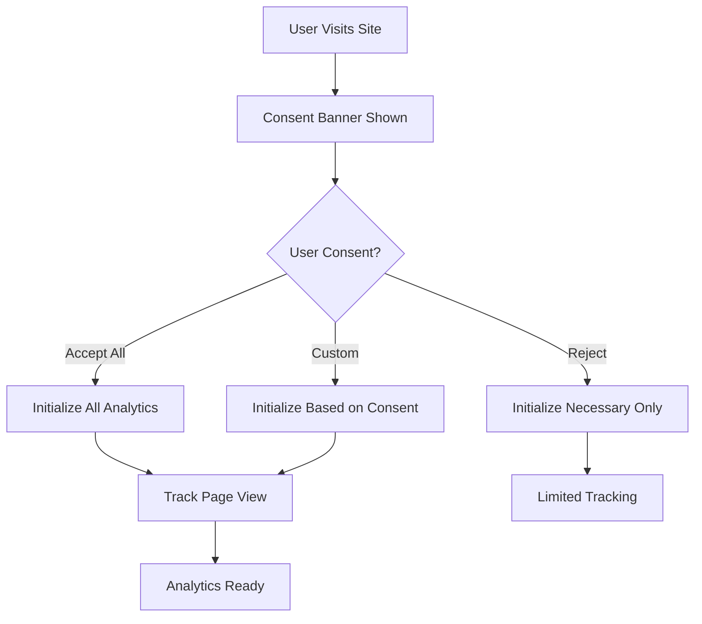

# 📊 Analytics Stack Documentation

**Kredytowy Patrol** - Comprehensive Analytics Implementation

---

## 🎯 **Analytics Stack Overview**

Our analytics stack provides comprehensive tracking, user behavior analysis, and performance monitoring while maintaining full GDPR compliance.

### **Core Analytics Services**

| Service | Purpose | Privacy Level | Consent Required |
|---------|---------|---------------|------------------|
| **Google Tag Manager** | Tag management, event orchestration | Medium | Analytics |
| **Google Analytics 4** | User behavior, conversions, funnels | Medium | Analytics |
| **Microsoft Clarity** | Session recordings, heatmaps | High | Analytics |
| **Facebook Pixel** | Social advertising, remarketing | Low | Marketing |
| **Cloudflare Analytics** | Privacy-first traffic analysis | High | None |
| **Vercel Analytics** | Performance metrics, Core Web Vitals | High | None |

---

## ⚙️ **Configuration & Setup**

### **Environment Variables**

Create a `.env.local` file with the following variables:

```bash
# SEO Configuration
NEXT_PUBLIC_SITE_URL=https://kredytowypatrol.pl

# Google Analytics 4
NEXT_PUBLIC_GA_MEASUREMENT_ID=G-8FTK6PSJBW

# Google Tag Manager
NEXT_PUBLIC_GTM_CONTAINER_ID=GTM-MW24LXJ9

# Microsoft Clarity (Session Recording & Heatmaps)
NEXT_PUBLIC_CLARITY_PROJECT_ID=skicu6w8b7

# Facebook Pixel
NEXT_PUBLIC_FACEBOOK_PIXEL_ID=your_pixel_id

# Cloudflare Web Analytics
NEXT_PUBLIC_CLOUDFLARE_ANALYTICS_TOKEN=your_cloudflare_token
```

### **Deployment Configuration**

1. **Vercel**: Environment variables are automatically configured
2. **Google Search Console**: Submit sitemap.xml
3. **Google Analytics**: Link GA4 property to GTM
4. **Microsoft Clarity**: Configure project in Clarity dashboard

---

## 🔧 **Implementation Architecture**

### **Analytics Initialization Flow**



### **Component Structure**

```
src/
├── lib/analytics.ts          # Core analytics functions
├── hooks/useAnalytics.ts     # React hook for tracking
├── contexts/ConsentContext.tsx # GDPR consent management
├── components/
│   ├── AnalyticsScripts.tsx  # Analytics script loading
│   └── CookieBanner.tsx      # GDPR consent banner
└── types/analytics.ts        # TypeScript definitions
```

---

## 📋 **Available Tracking Events**

### **Core Events**

```typescript
import { useAnalytics } from '@/hooks/useAnalytics';

const {
  track,                    // Generic event tracking
  trackPage,               // Page view tracking
  trackLoanInterest,       // Loan detail views
  trackLoanComparison,     // Comparison interactions
  trackBankClick,          // Bank link clicks
  trackFilterUsage,        // Filter interactions
  trackCalculator,         // Calculator usage
} = useAnalytics();
```

### **Financial Service Events**

#### **Loan Interest Tracking**
```typescript
trackLoanInterest('gotowkowy', 'PKO BP', 50000);
// Tracks: loan_interest
// Data: { loan_type, bank_name, amount, currency, interaction_type }
```

#### **Loan Comparison Tracking**
```typescript
trackLoanComparison('hipoteczny', ['PKO BP', 'mBank'], { 
  amount_filter: 200000,
  term_filter: 25 
});
// Tracks: loan_comparison
// Data: { loan_type, banks_compared, comparison_count, filters }
```

#### **Bank Link Click Tracking**
```typescript
trackBankClick('ING', 'gotowkowy', 3);
// Tracks: bank_link_click
// Data: { bank_name, loan_type, position, click_location }
```

#### **Filter Usage Tracking**
```typescript
trackFilterUsage('amount_range', '10000-50000', 'gotowkowy');
// Tracks: filter_usage
// Data: { filter_type, filter_value, loan_type, event_category }
```

#### **Calculator Usage Tracking**
```typescript
trackCalculator('loan_calculator', {
  amount: 50000,
  term: 48,
  interest_rate: 5.5
});
// Tracks: calculator_usage
// Data: { calculator_type, amount, term, interest_rate }
```

### **Custom Event Tracking**

```typescript
// Generic event tracking
track('custom_event_name', {
  custom_parameter: 'value',
  another_parameter: 123,
  event_category: 'engagement'
});
```

---

## 🍪 **GDPR Compliance**

### **Consent Categories**

1. **Necessary** (Always enabled)
   - Session management
   - Security features
   - Basic functionality

2. **Analytics** (Optional)
   - Google Analytics 4
   - Google Tag Manager
   - Microsoft Clarity
   - Cloudflare Analytics (privacy-first)

3. **Marketing** (Optional)
   - Facebook Pixel
   - Remarketing tags
   - Social media integration

4. **Preferences** (Optional)
   - User settings
   - Personalization
   - Theme preferences

### **Consent Management**

```typescript
import { useConsent } from '@/contexts/ConsentContext';

const { 
  consent,           // Current consent settings
  hasConsent,        // Whether user has made a choice
  updateConsent,     // Update specific consent
  acceptAll,         // Accept all categories
  rejectAll,         // Reject optional categories
  showPreferences    // Show consent preferences
} = useConsent();
```

### **Google Consent Mode v2**

Our implementation automatically handles Google Consent Mode v2:

```typescript
// Automatically set based on user consent
{
  ad_storage: 'denied',           // Marketing consent
  ad_user_data: 'denied',         // Marketing consent  
  ad_personalization: 'denied',   // Marketing consent
  analytics_storage: 'granted',   // Analytics consent
  functionality_storage: 'granted', // Preferences consent
  personalization_storage: 'granted', // Preferences consent
  security_storage: 'granted'     // Always granted
}
```

---

## 🔍 **Analytics Tools Guide**

### **1. Google Tag Manager (GTM)**

**Purpose**: Central tag management and event orchestration

**Key Features**:
- DataLayer event tracking
- Tag firing conditions
- Built-in variables
- Custom triggers

**Access**: [Google Tag Manager](https://tagmanager.google.com)
- Container ID: `GTM-MW24LXJ9`

**Best Practices**:
- Use dataLayer for all custom events
- Test in Preview mode before publishing
- Version control your container changes
- Document trigger conditions

### **2. Google Analytics 4 (GA4)**

**Purpose**: User behavior analysis and conversion tracking

**Key Features**:
- Enhanced ecommerce tracking
- Custom conversions
- Audience building
- Attribution reporting

**Access**: [Google Analytics](https://analytics.google.com)
- Measurement ID: `G-8FTK6PSJBW`

**Key Reports**:
- **Realtime**: Live user activity
- **Events**: Custom event analysis
- **Conversions**: Goal completions
- **Audiences**: User segmentation

### **3. Microsoft Clarity**

**Purpose**: User session recordings and heatmap analysis

**Key Features**:
- Session recordings
- Heatmaps (click, scroll, attention)
- Rage clicks detection
- Dead clicks identification

**Access**: [Microsoft Clarity](https://clarity.microsoft.com)
- Project ID: `skicu6w8b7`

**Insights for Financial Services**:
- How users interact with loan comparison tables
- Scroll patterns on product pages
- Form abandonment points
- Mobile vs desktop behavior differences

### **4. Facebook Pixel**

**Purpose**: Social media advertising and remarketing

**Key Features**:
- Custom audience creation
- Conversion tracking
- Lookalike audiences
- Cross-device tracking

**Setup**: Configure in Facebook Business Manager

### **5. Cloudflare Analytics**

**Purpose**: Privacy-first traffic analysis

**Key Features**:
- No cookies required
- GDPR compliant by default
- Bot traffic filtering
- Geographic insights

### **6. Vercel Analytics**

**Purpose**: Performance monitoring and Core Web Vitals

**Key Features**:
- Real User Monitoring (RUM)
- Core Web Vitals tracking
- Page performance insights
- Automatic integration

---

## 🛠️ **Development & Debugging**

### **Analytics Debugger (Development)**

In development mode, a debugging tool is automatically available:

```javascript
// Available in browser console
window.analyticsDebugger = {
  config: ANALYTICS_CONFIG,           // Current configuration
  healthCheck: checkAnalyticsHealth,  // Check service status
  testEvent: (name, params) => {...}, // Test event firing
  testPageView: (url) => {...},      // Test page view
  clearDataLayer: () => {...}        // Clear GTM dataLayer
};
```

### **Health Check**

Monitor analytics service status:

```typescript
import { checkAnalyticsHealth } from '@/lib/analytics';

const healthStatus = checkAnalyticsHealth();
// Returns: { gtm_loaded, ga4_loaded, facebook_loaded, clarity_loaded, cloudflare_loaded }
```

### **Console Logging**

In development, all analytics events are logged:

```
🔍 [GTM DataLayer] loan_comparison { loan_type: 'gotowkowy', banks_compared: ['PKO', 'mBank'] }
🔍 [GA4] loan_comparison { loan_type: 'gotowkowy', banks_compared: ['PKO', 'mBank'] }
🔍 [Facebook Pixel] loan_comparison { loan_type: 'gotowkowy', banks_compared: ['PKO', 'mBank'] }
```

### **Testing Analytics**

#### **1. GTM Preview Mode**
1. Open [Google Tag Manager](https://tagmanager.google.com)
2. Click **Preview** in your container
3. Enter your site URL
4. Navigate and watch tag firing in real-time

#### **2. GA4 DebugView**
1. Open Google Analytics 4
2. Go to **Configure > DebugView**
3. Enable debug mode in your browser
4. See events in real-time

#### **3. Browser Developer Tools**
```javascript
// Check GTM dataLayer
console.log(window.dataLayer);

// Check GA4 availability
console.log(window.gtag);

// Test manual event
dataLayer.push({
  event: 'test_event',
  test_parameter: 'hello'
});
```

---

## 📈 **Key Performance Indicators (KPIs)**

### **Traffic Metrics**
- Unique visitors
- Page views
- Bounce rate
- Session duration
- Traffic sources

### **Engagement Metrics**
- Loan comparison interactions
- Filter usage frequency
- Calculator usage
- Bank link click-through rates
- Time spent on comparison pages

### **Conversion Metrics**
- Bank application clicks
- Email signups
- Contact form submissions
- Loan detail page views
- Comparison to application conversion rate

### **Technical Metrics**
- Page load times
- Core Web Vitals (LCP, FID, CLS)
- Error rates
- Analytics loading performance

---

## 🚀 **Performance Optimizations**

### **Script Loading Strategy**

```typescript
// Analytics scripts use afterInteractive strategy
<Script strategy="afterInteractive" />
```

### **Error Handling**

All analytics functions include error handling:

```typescript
const safelyExecute = (fn: () => void, context: string) => {
  try {
    fn();
  } catch (error) {
    console.error(`❌ Analytics error in ${context}:`, error);
    // Track analytics failures in GA4
  }
};
```

### **Performance Monitoring**

Analytics initialization is monitored:

```typescript
const startTime = performance.now();
// ... initialize analytics ...
const endTime = performance.now();
logAnalyticsEvent('Analytics', 'Initialization completed', {
  duration: `${(endTime - startTime).toFixed(2)}ms`
});
```

---

## ✅ **Best Practices**

### **Event Naming**

Use consistent naming conventions:
- Use snake_case for event names: `loan_comparison`
- Use descriptive parameter names: `loan_type`, `bank_name`
- Include category for organization: `event_category: 'engagement'`

### **Data Quality**

```typescript
// Always validate event data
const validateEventData = (eventName, parameters) => {
  if (!eventName || typeof eventName !== 'string') return false;
  if (parameters && typeof parameters !== 'object') return false;
  return true;
};
```

### **Privacy & Security**

- Never track PII (personal identifiable information)
- Use hashed user IDs when necessary
- Respect user consent choices
- Regular consent banner testing
- GDPR compliance auditing

### **Performance**

- Load analytics scripts after page interaction
- Use error boundaries for analytics code
- Monitor analytics loading impact
- Implement fallbacks for failed services

---

## 🆘 **Troubleshooting**

### **Common Issues**

#### **Analytics Not Loading**
1. Check environment variables
2. Verify script loading in Network tab
3. Check console for JavaScript errors
4. Ensure consent is granted

#### **Events Not Firing**
1. Check consent settings
2. Verify event validation
3. Use GTM Preview mode
4. Check dataLayer contents

#### **Consent Issues**
1. Clear localStorage and test fresh
2. Check consent version compatibility
3. Verify consent categories mapping

### **Debug Commands**

```javascript
// Check analytics health
window.analyticsDebugger.healthCheck()

// Test event tracking
window.analyticsDebugger.testEvent('test_event', { test: true })

// Clear dataLayer
window.analyticsDebugger.clearDataLayer()

// Check configuration
window.analyticsDebugger.config
```

---

## 📞 **Support & Maintenance**

### **Regular Tasks**

- **Weekly**: Review GA4 real-time reports
- **Monthly**: Analyze Clarity session recordings
- **Quarterly**: Audit consent banner compliance
- **Annually**: Update consent version and re-prompt users

### **Monitoring Alerts**

Set up alerts for:
- Analytics loading failures
- Conversion rate drops
- High error rates
- Performance degradation

---

## 📚 **Additional Resources**

- [Google Analytics 4 Documentation](https://support.google.com/analytics)
- [Google Tag Manager Guide](https://support.google.com/tagmanager)
- [Microsoft Clarity Help Center](https://docs.microsoft.com/en-us/clarity/)
- [Facebook Pixel Documentation](https://developers.facebook.com/docs/facebook-pixel)
- [GDPR Compliance Guide](https://gdpr.eu/)

---

**Last Updated**: $(date)
**Version**: 2.0
**Status**: ✅ Production Ready 