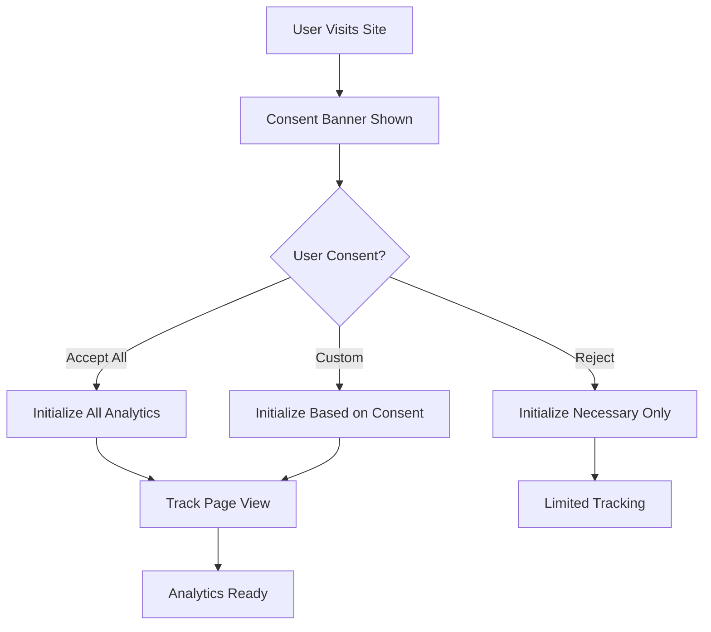

# 📊 Analytics Stack Documentation

**Kredytowy Patrol** - Comprehensive Analytics Implementation

---

## 🎯 **Analytics Stack Overview**

Our analytics stack provides comprehensive tracking, user behavior analysis, and performance monitoring while maintaining full GDPR compliance.

### **Core Analytics Services**

| Service | Purpose | Privacy Level | Consent Required |
|---------|---------|---------------|------------------|
| **Google Tag Manager** | Tag management, event orchestration | Medium | Analytics |
| **Google Analytics 4** | User behavior, conversions, funnels | Medium | Analytics |
| **Microsoft Clarity** | Session recordings, heatmaps | High | Analytics |
| **Facebook Pixel** | Social advertising, remarketing | Low | Marketing |
| **Cloudflare Analytics** | Privacy-first traffic analysis | High | None |
| **Vercel Analytics** | Performance metrics, Core Web Vitals | High | None |

---

## ⚙️ **Configuration & Setup**

### **Environment Variables**

Create a `.env.local` file with the following variables:

```bash
# SEO Configuration
NEXT_PUBLIC_SITE_URL=https://kredytowypatrol.pl

# Google Analytics 4
NEXT_PUBLIC_GA_MEASUREMENT_ID=G-8FTK6PSJBW

# Google Tag Manager
NEXT_PUBLIC_GTM_CONTAINER_ID=GTM-MW24LXJ9

# Microsoft Clarity (Session Recording & Heatmaps)
NEXT_PUBLIC_CLARITY_PROJECT_ID=skicu6w8b7

# Facebook Pixel
NEXT_PUBLIC_FACEBOOK_PIXEL_ID=your_pixel_id

# Cloudflare Web Analytics
NEXT_PUBLIC_CLOUDFLARE_ANALYTICS_TOKEN=your_cloudflare_token
```

### **Deployment Configuration**

1. **Vercel**: Environment variables are automatically configured
2. **Google Search Console**: Submit sitemap.xml
3. **Google Analytics**: Link GA4 property to GTM
4. **Microsoft Clarity**: Configure project in Clarity dashboard

---

## 🔧 **Implementation Architecture**

### **Analytics Initialization Flow**



### **Component Structure**

```
src/
├── lib/analytics.ts          # Core analytics functions
├── hooks/useAnalytics.ts     # React hook for tracking
├── contexts/ConsentContext.tsx # GDPR consent management
├── components/
│   ├── AnalyticsScripts.tsx  # Analytics script loading
│   └── CookieBanner.tsx      # GDPR consent banner
└── types/analytics.ts        # TypeScript definitions
```

---

## 📋 **Available Tracking Events**

### **Core Events**

```typescript
import { useAnalytics } from '@/hooks/useAnalytics';

const {
  track,                    // Generic event tracking
  trackPage,               // Page view tracking
  trackLoanInterest,       // Loan detail views
  trackLoanComparison,     // Comparison interactions
  trackBankClick,          // Bank link clicks
  trackFilterUsage,        // Filter interactions
  trackCalculator,         // Calculator usage
  trackDepositInterest,    // Deposit detail views
  trackSavingsAccount,     // Savings account interactions
  trackTreasuryBond,       // Treasury bond interactions
  trackBlogInteraction,    // Blog engagement
} = useAnalytics();
```

### **Financial Service Events**

#### **Loan Interest Tracking**
```typescript
trackLoanInterest('gotowkowy', 'PKO BP', 50000);
// Tracks: loan_interest
// Data: { loan_type, bank_name, amount, currency, interaction_type }
```

#### **Loan Comparison Tracking**
```typescript
trackLoanComparison('hipoteczny', ['PKO BP', 'mBank'], { 
  amount_filter: 200000,
  term_filter: 25 
});
// Tracks: loan_comparison
// Data: { loan_type, banks_compared, comparison_count, filters }
```

#### **Bank Link Click Tracking**
```typescript
trackBankClick('ING', 'gotowkowy', 3);
// Tracks: bank_link_click
// Data: { bank_name, loan_type, position, click_location }
```

#### **Filter Usage Tracking**
```typescript
trackFilterUsage('amount_range', '10000-50000', 'gotowkowy');
// Tracks: filter_usage
// Data: { filter_type, filter_value, loan_type, event_category }
```

#### **Calculator Usage Tracking**
```typescript
trackCalculator('loan_calculator', {
  amount: 50000,
  term: 48,
  interest_rate: 5.5
});
// Tracks: calculator_usage
// Data: { calculator_type, amount, term, interest_rate }
```

### **Deposit & Savings Events**

#### **Deposit Interest Tracking**
```typescript
trackDepositInterest('Lokata PLN', 'PKO BP', 10000, 12);
// Tracks: deposit_interest
// Data: { deposit_type, bank_name, amount, period, interest_rate }
```

#### **Currency Deposit Tracking**
```typescript
trackCurrencyDeposit('EUR', 'Santander', 5000, 6);
// Tracks: currency_deposit
// Data: { currency, bank_name, amount, period, interest_rate }
```

#### **Savings Account Tracking**
```typescript
trackSavingsAccount('Konto Oszczędnościowe', 'mBank', 0.5);
// Tracks: savings_account
// Data: { account_type, bank_name, interest_rate, features }
```

### **Treasury Bond Events**

#### **Bond Interest Tracking**
```typescript
trackTreasuryBond('OS0424', 6.25, 2);
// Tracks: treasury_bond
// Data: { bond_symbol, interest_rate, duration, risk_level }
```

### **Blog & Content Events**

#### **Blog Engagement Tracking**
```typescript
trackBlogInteraction('post_view', 'finanse-osobiste', 'Jak oszczędzać pieniądze');
// Tracks: blog_interaction
// Data: { interaction_type, category, post_title, author }
```

#### **Content Category Tracking**
```typescript
trackContentCategory('finanse-osobiste', 'kredyty', 5);
// Tracks: content_category
// Data: { category, subcategory, post_count, engagement_level }
```

### **Custom Event Tracking**

```typescript
// Generic event tracking
track('custom_event_name', {
  custom_parameter: 'value',
  another_parameter: 123,
  event_category: 'engagement'
});
```

---

## 🍪 **GDPR Compliance**

### **Consent Categories**

1. **Necessary** (Always enabled)
   - Session management
   - Security features
   - Basic functionality

2. **Analytics** (Optional)
   - Google Analytics 4
   - Google Tag Manager
   - Microsoft Clarity
   - Cloudflare Analytics (privacy-first)

3. **Marketing** (Optional)
   - Facebook Pixel
   - Remarketing tags
   - Social media integration

4. **Preferences** (Optional)
   - User settings
   - Personalization
   - Theme preferences

### **Consent Management**

```typescript
import { useConsent } from '@/contexts/ConsentContext';

const { 
  consent,           // Current consent settings
  hasConsent,        // Whether user has made a choice
  updateConsent,     // Update specific consent
  acceptAll,         // Accept all categories
  rejectAll,         // Reject optional categories
  resetConsent       // Reset to default state
} = useConsent();

// Check if user has consented to analytics
if (hasConsent('analytics')) {
  // Initialize analytics tracking
  initializeAnalytics();
}

// Update specific consent
updateConsent('marketing', true);
```

### **Cookie Banner Implementation**

```typescript
// src/components/CookieBanner.tsx
export function CookieBanner() {
  const { consent, hasConsent, acceptAll, rejectAll, updateConsent } = useConsent();

  if (hasConsent) return null;

  return (
    <div className="cookie-banner">
      <div className="cookie-content">
        <h3>Używamy plików cookie</h3>
        <p>Używamy plików cookie do analizy ruchu i personalizacji treści.</p>
        
        <div className="cookie-options">
          <label>
            <input
              type="checkbox"
              checked={consent.analytics}
              onChange={(e) => updateConsent('analytics', e.target.checked)}
            />
            Analityka (Google Analytics, Clarity)
          </label>
          
          <label>
            <input
              type="checkbox"
              checked={consent.marketing}
              onChange={(e) => updateConsent('marketing', e.target.checked)}
            />
            Marketing (Facebook Pixel)
          </label>
        </div>
        
        <div className="cookie-actions">
          <button onClick={acceptAll}>Akceptuj wszystkie</button>
          <button onClick={rejectAll}>Odrzuć opcjonalne</button>
          <button onClick={() => updateConsent('necessary', true)}>Tylko niezbędne</button>
        </div>
      </div>
    </div>
  );
}
```

---

## 🔍 **Event Tracking Implementation**

### **Google Analytics 4 Events**

#### **Enhanced Ecommerce Tracking**
```typescript
// Track loan product views
gtag('event', 'view_item', {
  currency: 'PLN',
  value: 50000,
  items: [{
    item_id: 'kredyt_gotowkowy_pko_bp',
    item_name: 'Kredyt Gotówkowy PKO BP',
    item_category: 'Kredyty',
    item_brand: 'PKO BP',
    price: 0,
    quantity: 1
  }]
});

// Track loan comparisons
gtag('event', 'add_to_cart', {
  currency: 'PLN',
  value: 0,
  items: [{
    item_id: 'kredyt_porownanie',
    item_name: 'Porównanie Kredytów',
    item_category: 'Kredyty',
    price: 0,
    quantity: 1
  }]
});
```

#### **Custom Dimensions & Metrics**
```typescript
// Set custom dimensions
gtag('config', 'G-XXXXXXXXXX', {
  custom_map: {
    'custom_map_1': 'loan_type',
    'custom_map_2': 'bank_name',
    'custom_map_3': 'amount_range',
    'custom_map_4': 'user_segment'
  }
});

// Track with custom dimensions
gtag('event', 'loan_interest', {
  loan_type: 'gotowkowy',
  bank_name: 'PKO BP',
  amount_range: '50000-100000',
  user_segment: 'new_user'
});
```

### **Google Tag Manager Events**

#### **Data Layer Events**
```typescript
// Push events to data layer
window.dataLayer = window.dataLayer || [];

window.dataLayer.push({
  event: 'loan_interest',
  loan_type: 'gotowkowy',
  bank_name: 'PKO BP',
  amount: 50000,
  currency: 'PLN',
  interest_rate: 5.5,
  rrso: 6.2
});

window.dataLayer.push({
  event: 'deposit_interest',
  deposit_type: 'Lokata PLN',
  bank_name: 'mBank',
  amount: 10000,
  period: 12,
  interest_rate: 4.5
});
```

#### **GTM Triggers & Tags**
```typescript
// GTM Configuration
const gtmConfig = {
  id: process.env.NEXT_PUBLIC_GTM_CONTAINER_ID,
  dataLayer: {
    page_title: document.title,
    page_location: window.location.href,
    user_consent: consent
  }
};
```

### **Microsoft Clarity Events**

#### **Custom Events**
```typescript
// Track custom events in Clarity
if (window.clarity) {
  window.clarity('set', 'loan_type', 'gotowkowy');
  window.clarity('set', 'bank_name', 'PKO BP');
  window.clarity('set', 'amount_range', '50000-100000');
  
  // Track specific interactions
  window.clarity('event', 'loan_calculator_used');
  window.clarity('event', 'comparison_started');
  window.clarity('event', 'bank_link_clicked');
}
```

---

## 📊 **Performance Monitoring**

### **Vercel Analytics Integration**

#### **Core Web Vitals Tracking**
```typescript
// Vercel Analytics automatically tracks:
// - LCP (Largest Contentful Paint)
// - FID (First Input Delay)
// - CLS (Cumulative Layout Shift)
// - FCP (First Contentful Paint)
// - TTFB (Time to First Byte)

import { Analytics } from '@vercel/analytics/react';
import { SpeedInsights } from '@vercel/speed-insights/next';

export default function Layout({ children }) {
  return (
    <html>
      <body>
        {children}
        <Analytics />
        <SpeedInsights />
      </body>
    </html>
  );
}
```

#### **Custom Performance Metrics**
```typescript
// Track custom performance metrics
const trackPerformance = (metric: string, value: number) => {
  if (window.gtag) {
    gtag('event', 'custom_performance', {
      metric_name: metric,
      metric_value: value,
      event_category: 'performance'
    });
  }
};

// Track loan calculation performance
const trackLoanCalculation = (startTime: number) => {
  const endTime = performance.now();
  const duration = endTime - startTime;
  
  trackPerformance('loan_calculation_duration', duration);
};
```

### **Cloudflare Analytics**

#### **Privacy-First Tracking**
```typescript
// Cloudflare Analytics - no cookies required
const cloudflareAnalytics = {
  token: process.env.NEXT_PUBLIC_CLOUDFLARE_ANALYTICS_TOKEN,
  script: 'https://static.cloudflareinsights.com/beacon.min.js'
};

// Automatically tracks:
// - Page views
// - User sessions
// - Performance metrics
// - Geographic data
// - Device information
```

---

## 🎯 **Conversion Tracking**

### **Loan Application Funnels**

#### **Funnel Steps**
1. **Landing Page** - User arrives on loan comparison page
2. **Product View** - User views specific loan details
3. **Comparison** - User compares multiple loans
4. **Calculator** - User uses loan calculator
5. **Bank Click** - User clicks on bank link
6. **Application** - User applies for loan (external)

#### **Funnel Tracking Implementation**
```typescript
// Track funnel progression
const trackFunnelStep = (step: string, stepNumber: number, data: any) => {
  gtag('event', 'funnel_step', {
    funnel_name: 'loan_application',
    step_name: step,
    step_number: stepNumber,
    ...data
  });
};

// Example usage
trackFunnelStep('product_view', 2, {
  loan_type: 'gotowkowy',
  bank_name: 'PKO BP',
  amount: 50000
});

trackFunnelStep('comparison', 3, {
  loans_compared: ['PKO BP', 'mBank', 'ING'],
  comparison_duration: 45
});
```

### **Deposit & Savings Funnels**

#### **Deposit Funnel**
1. **Landing** - User arrives on deposit page
2. **Product View** - User views deposit details
3. **Calculator** - User calculates potential returns
4. **Bank Click** - User clicks on bank link

#### **Savings Account Funnel**
1. **Landing** - User arrives on savings page
2. **Product View** - User views account details
3. **Feature Comparison** - User compares features
4. **Bank Click** - User clicks on bank link

---

## 📱 **Mobile & Cross-Device Tracking**

### **Device Detection**
```typescript
// Detect device type and capabilities
const getDeviceInfo = () => {
  const userAgent = navigator.userAgent;
  const isMobile = /Mobile|Android|iPhone|iPad/.test(userAgent);
  const isTablet = /iPad|Android(?=.*\bMobile\b)(?=.*\bSafari\b)/.test(userAgent);
  
  return {
    device_type: isMobile ? 'mobile' : isTablet ? 'tablet' : 'desktop',
    user_agent: userAgent,
    screen_resolution: `${screen.width}x${screen.height}`,
    viewport: `${window.innerWidth}x${window.innerHeight}`
  };
};

// Track device-specific interactions
const trackDeviceInteraction = (event: string, data: any) => {
  const deviceInfo = getDeviceInfo();
  
  track(event, {
    ...data,
    device_type: deviceInfo.device_type,
    screen_resolution: deviceInfo.screen_resolution
  });
};
```

### **Cross-Device User Journey**
```typescript
// Track user journey across devices
const trackCrossDeviceJourney = (journeyId: string, step: string, data: any) => {
  // Store journey data in localStorage or sessionStorage
  const journey = JSON.parse(localStorage.getItem('user_journey') || '{}');
  
  journey[journeyId] = {
    ...journey[journeyId],
    [step]: {
      timestamp: new Date().toISOString(),
      device: getDeviceInfo(),
      data: data
    }
  };
  
  localStorage.setItem('user_journey', JSON.stringify(journey));
  
  // Track in analytics
  track('cross_device_journey', {
    journey_id: journeyId,
    step: step,
    device_type: getDeviceInfo().device_type,
    ...data
  });
};
```

---

## 🔒 **Data Privacy & Security**

### **Data Anonymization**
```typescript
// Anonymize sensitive data before tracking
const anonymizeData = (data: any) => {
  const anonymized = { ...data };
  
  // Remove or hash sensitive information
  if (anonymized.email) {
    anonymized.email = anonymized.email.replace(/(.{2}).*@/, '$1***@');
  }
  
  if (anonymized.phone) {
    anonymized.phone = anonymized.phone.replace(/(\d{3})\d{3}(\d{3})/, '$1***$2');
  }
  
  return anonymized;
};

// Use anonymized data for tracking
const trackWithPrivacy = (event: string, data: any) => {
  const anonymizedData = anonymizeData(data);
  track(event, anonymizedData);
};
```

### **Data Retention Policies**
```typescript
// Implement data retention policies
const cleanupOldData = () => {
  const retentionDays = 90; // Keep data for 90 days
  const cutoffDate = new Date();
  cutoffDate.setDate(cutoffDate.getDate() - retentionDays);
  
  // Clean up old analytics data
  const oldData = localStorage.getItem('analytics_data');
  if (oldData) {
    const data = JSON.parse(oldData);
    const filtered = data.filter(item => 
      new Date(item.timestamp) > cutoffDate
    );
    localStorage.setItem('analytics_data', JSON.stringify(filtered));
  }
};

// Run cleanup periodically
setInterval(cleanupOldData, 24 * 60 * 60 * 1000); // Daily
```

---

## 📈 **Reporting & Insights**

### **Custom Dashboards**

#### **Financial Product Performance**
- **Loan Conversion Rates** by type and bank
- **Deposit Interest** by period and amount
- **Savings Account** engagement metrics
- **Treasury Bond** performance tracking

#### **User Behavior Analysis**
- **Page Performance** by product category
- **Calculator Usage** patterns
- **Comparison Tool** effectiveness
- **Mobile vs Desktop** behavior differences

#### **Content Performance**
- **Blog Engagement** by category and author
- **Content Discovery** through search and navigation
- **User Journey** through financial education content

### **Automated Reports**
```typescript
// Generate automated reports
const generateWeeklyReport = async () => {
  const report = {
    period: 'weekly',
    start_date: getWeekStart(),
    end_date: getWeekEnd(),
    metrics: {
      total_users: await getTotalUsers(),
      loan_interactions: await getLoanInteractions(),
      deposit_interactions: await getDepositInteractions(),
      blog_engagement: await getBlogEngagement(),
      conversion_rate: await getConversionRate()
    }
  };
  
  // Send report via email or API
  await sendReport(report);
};

// Schedule weekly reports
setInterval(generateWeeklyReport, 7 * 24 * 60 * 60 * 1000);
```

---

## 🚀 **Advanced Analytics Features**

### **Predictive Analytics**
```typescript
// Predict user behavior based on historical data
const predictUserBehavior = (userData: any) => {
  // Analyze user patterns
  const patterns = analyzeUserPatterns(userData);
  
  // Predict next likely action
  const prediction = {
    next_action: patterns.most_likely_action,
    confidence: patterns.confidence_score,
    recommended_content: patterns.recommended_content
  };
  
  return prediction;
};

// Use predictions for personalization
const personalizeExperience = (userData: any) => {
  const prediction = predictUserBehavior(userData);
  
  if (prediction.confidence > 0.7) {
    // Show personalized content
    showPersonalizedContent(prediction.recommended_content);
  }
};
```

### **A/B Testing Integration**
```typescript
// A/B testing for financial products
const runABTest = (testName: string, variants: string[]) => {
  const variant = variants[Math.floor(Math.random() * variants.length)];
  
  // Track test assignment
  track('ab_test_assignment', {
    test_name: testName,
    variant: variant,
    user_id: getUserId()
  });
  
  return variant;
};

// Example: Test different loan comparison layouts
const layoutVariant = runABTest('loan_comparison_layout', ['table', 'cards', 'list']);
```

---

## 🔧 **Troubleshooting & Debugging**

### **Common Issues**

#### **Analytics Not Loading**
```typescript
// Check if analytics scripts are loaded
const checkAnalyticsStatus = () => {
  const status = {
    gtag: typeof window !== 'undefined' && window.gtag,
    gtm: typeof window !== 'undefined' && window.dataLayer,
    clarity: typeof window !== 'undefined' && window.clarity,
    cloudflare: typeof window !== 'undefined' && window.cloudflare
  };
  
  console.log('Analytics Status:', status);
  return status;
};
```

#### **Event Tracking Issues**
```typescript
// Debug event tracking
const debugEventTracking = (eventName: string, data: any) => {
  console.log('Tracking Event:', eventName, data);
  
  // Check if analytics is ready
  if (!window.gtag) {
    console.warn('Google Analytics not ready');
    return;
  }
  
  // Track event
  gtag('event', eventName, data);
  
  // Verify tracking
  console.log('Event tracked successfully');
};
```

### **Development vs Production**
```typescript
// Different tracking in development
const isDevelopment = process.env.NODE_ENV === 'development';

const trackEvent = (eventName: string, data: any) => {
  if (isDevelopment) {
    console.log('DEV - Event:', eventName, data);
    return;
  }
  
  // Production tracking
  gtag('event', eventName, data);
};
```

---

## 📚 **Best Practices**

### **Event Naming Conventions**
- **Consistent Format**: `object_action` (e.g., `loan_view`, `deposit_calculate`)
- **Descriptive Names**: Clear and specific event names
- **Lowercase**: Use lowercase with underscores
- **No Spaces**: Avoid spaces in event names

### **Data Structure Standards**
- **Consistent Properties**: Use same property names across events
- **Data Types**: Ensure consistent data types (string, number, boolean)
- **Required Fields**: Define required vs optional fields
- **Validation**: Validate data before sending

### **Performance Considerations**
- **Batch Events**: Group related events when possible
- **Async Tracking**: Don't block UI for analytics
- **Error Handling**: Handle analytics errors gracefully
- **Rate Limiting**: Avoid overwhelming analytics services

---

**Kredytowy Patrol** - Comprehensive Analytics for Financial Products 🏦 