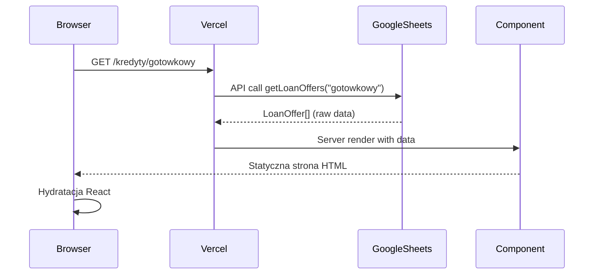

# 🏗️ Architektura Systemu Kredytowy Patrol - Analiza UML

## 📋 Spis Treści
1. [Przegląd Architektury](#przegląd-architektury)
2. [Usługi Zewnętrzne](#usługi-zewnętrzne)
3. [Platforma Vercel](#platforma-vercel)
4. [Przepływ Danych](#przepływ-danych)
5. [Struktura Komponentów](#struktura-komponentów)
6. [System Typów](#system-typów)
7. [Cache i Performance](#cache-i-performance)
8. [Bezpieczeństwo i GDPR](#bezpieczeństwo-i-gdpr)
9. [Deployment Pipeline](#deployment-pipeline)

---

## 🎯 Przegląd Architektury

**Kredytowy Patrol** to nowoczesna aplikacja finansowa zbudowana w architekturze **JAMstack** (JavaScript, APIs, Markup) z użyciem **Next.js 15**, hostowana na **Vercel** i integrująca się z wieloma usługami zewnętrznymi.

### 🔧 Kluczowe Technologie
- **Frontend**: Next.js 15 + React 19 + TypeScript 5 + Tailwind CSS 4
- **Hosting**: Vercel (Edge Network + Serverless Functions)
- **CMS**: Sanity.io (Headless CMS dla bloga)
- **Dane**: Google Sheets API (produkty finansowe)
- **Backend**: Firebase Functions + Firestore
- **Analityka**: Google Analytics 4, Microsoft Clarity, Cloudflare Analytics

---

## 🌐 Usługi Zewnętrzne

### 📊 Google Sheets API
**Rola**: Główne źródło danych dla produktów finansowych

**Struktura arkuszy**:
```typescript
📊 Google Sheets
├── 🏷️ Logo                     // Logo banków i instytucji
├── 💳 Kredyt_Gotówkowy         // Oferty kredytów gotówkowych  
├── 💳 Kredyt_Hipoteczny        // Oferty kredytów hipotecznych
├── 💳 Kredyt_Konsolidacyjny    // Oferty kredytów konsolidacyjnych
├── 💰 Lokata                   // Lokaty standardowe (PLN)
├── 💱 Lokaty_Walutowe          // Lokaty w walutach obcych
├── 🏪 Konto_Oszczędnościowe    // Konta oszczędnościowe
└── 🏛️ Obligacje_Skarbowe       // Obligacje skarbowe
```

**Przepływ danych**:
1. Google Sheets → Google Sheets API v4
2. API Client (`google-sheets.ts`) → Server Components
3. Server-Side Rendering → Statyczne HTML
4. Automatyczna rewalidacja przy zmianach

### 🏢 Sanity.io CMS
**Rola**: Zarządzanie treścią bloga "FinanSowa"

**Struktura dokumentów**:
```typescript
🏢 Sanity.io CMS
├── 📄 Post Documents
│   ├── title: string
│   ├── slug: SanitySlug
│   ├── author: Author
│   ├── mainImage: SanityImage
│   ├── categories: Category[]
│   ├── publishedAt: string
│   ├── excerpt: string
│   ├── body: PortableText[]
│   └── seo: SEOSettings
├── ✍️ Author Documents
│   ├── name: string
│   ├── slug: SanitySlug
│   ├── image: SanityImage
│   └── bio: PortableText[]
└── 📂 Category Documents
    ├── title: string
    ├── slug: SanitySlug
    ├── image?: SanityImage
    └── description?: string
```

**Zapytania GROQ**:
```groq
// Pobieranie wszystkich postów
*[_type == "post" && !(_id in path("drafts.**"))] | order(publishedAt desc) {
  _id, title, slug, author->{name, slug, image},
  mainImage, categories[]->{title}, publishedAt, excerpt, body
}

// Pobieranie pojedynczego posta
*[_type == "post" && slug.current == $slug][0] {
  _id, title, slug, author->{name, slug, image},
  mainImage, categories[]->{_id, title, slug},
  publishedAt, excerpt, body, seo
}
```

### 🔥 Firebase Backend
**Rola**: Obsługa formularzy kontaktowych i newslettera

**Cloud Functions**:
```typescript
🔥 Firebase Functions (europe-central2)
├── 📧 submitContactForm
│   ├── Input: ContactFormData + ServiceAccount
│   ├── Validation: Email, Required Fields, Consent
│   ├── Storage: Firestore collection "contact_submissions"
│   └── Response: Success/Error JSON
└── 📬 subscribeNewsletter  
    ├── Input: Email + Metadata + ServiceAccount
    ├── Validation: Email format, Duplicates
    ├── Storage: Firestore collection "newsletter_subscriptions"
    └── Response: Success/Error JSON
```

**Firestore Collections**:
```typescript
📁 contact_submissions/
├── name: string
├── email: string
├── phone?: string
├── subject: string
├── message: string
├── consent: boolean
├── type: "contact_form"
├── status: "new" | "processed"
└── metadata: ClientMetadata & ServerMetadata

📁 newsletter_subscriptions/
├── email: string (unique)
├── subscribed: boolean
├── type: "newsletter"
└── metadata: ClientMetadata & ServerMetadata
```

### 📈 Analityka Multi-Platform
**Google Analytics 4 + GTM**:
```typescript
// Enhanced tracking events
trackEvent("loan_interest", {
  loan_type: "gotowkowy",
  bank_name: "PKO BP", 
  amount: 50000,
  currency: "PLN"
});

trackLoanComparison("gotowkowy", ["PKO BP", "mBank"], {
  amount: 50000,
  months: 48
});
```

**Microsoft Clarity**: Session recording, heatmapy, user behavior analysis
**Cloudflare Analytics**: Privacy-first analytics, Core Web Vitals

---

## 🚀 Platforma Vercel

### 📱 Next.js 15 App Router
**Struktura routingu**:
```typescript
📱 App Router Structure
├── / (page.tsx)                     // Strona główna
├── /kredyty/[slug]/page.tsx         // Dynamiczne kredyty
├── /lokata/page.tsx                 // Lokaty PLN
├── /lokaty-walutowe/page.tsx        // Lokaty walutowe  
├── /konto-oszczednosciowe/page.tsx  // Konta oszczędnościowe
├── /obligacje-skarbowe/page.tsx     // Obligacje skarbowe
├── /finansowa/aktualnosci/page.tsx  // Blog FinanSowa
├── /api/revalidate                  // Cache invalidation
├── /api/contact                     // Proxy do Firebase
└── /api/newsletter                  // Proxy do Firebase
```

### 🔧 Core Libraries
**google-sheets.ts**:
```typescript
// Client dla Google Sheets API v4
class GoogleSheetsClient {
  async getLoanOffers(loanType: string): Promise<LoanOffer[]>
  async getDepositOffers(): Promise<DepositOffer[]>
  async getCurrencyDepositOffers(): Promise<CurrencyDepositOffer[]>
  async getSavingsAccountOffers(): Promise<SavingsAccountOffer[]>
  async getTreasuryBondOffers(): Promise<TreasuryBondOffer[]>
  async getLogos(): Promise<Logo[]>
}
```

**sanity.ts**:
```typescript
// Client dla Sanity.io z GROQ
class SanityClient {
  async getPosts(): Promise<Post[]>
  async getPost(slug: string): Promise<Post>
  async getCategories(): Promise<Category[]>
  async getPostsByCategory(categoryId: string): Promise<Post[]>
}
```

**analytics.ts**:
```typescript
// Multi-platform analytics z consent management
class AnalyticsManager {
  initializeGTM(consent: ConsentSettings): void
  initializeFacebookPixel(consent: ConsentSettings): void
  initializeClarity(): void
  initializeCloudflareAnalytics(): void
  trackEvent(name: string, params?: Record<string, any>): void
  trackPageView(url: string, title?: string): void
}
```

---

## 🔄 Przepływ Danych

### 1. Pobieranie Danych Finansowych


### 2. Obliczenia Finansowe w Komponencie
```typescript
// Przykład obliczeń w Ranking.tsx
const calculatedOffers = useMemo(() => {
  return initialLoanOffers
    .filter(offer => amount <= offer.maxLoanValue && months <= offer.maxLoanTime)
    .map(offer => {
      const principal = amount;
      const commissionAmount = principal * (offer.commission / 100);
      const totalPrincipal = principal + commissionAmount;
      const monthlyInterestRate = offer.baseInterestRate / 100 / 12;
      
      const monthlyRate = totalPrincipal * 
        (monthlyInterestRate * Math.pow(1 + monthlyInterestRate, months)) /
        (Math.pow(1 + monthlyInterestRate, months) - 1);

      return {
        ...offer,
        totalAmount: monthlyRate * months,
        monthlyRate,
        // Enhanced calculated fields
      } as CalculatedLoanOffer;
    })
    .sort((a, b) => a.monthlyRate - b.monthlyRate);
}, [amount, months, initialLoanOffers]);
```

### 3. Rewalidacja Cache
```typescript
// Automatyczna rewalidacja przy zmianach w Google Sheets
POST /api/revalidate?secret=XXX
{
  "sheetName": "Kredyt_Gotówkowy"
}

// Mapowanie arkuszy na ścieżki
const editedSheetToSlug = {
  'Kredyt_Gotówkowy': 'gotowkowy',
  'Kredyt_Hipoteczny': 'hipoteczny', 
  'Kredyt_Konsolidacyjny': 'konsolidacyjny',
};

// Rewalidacja odpowiednich ścieżek
revalidatePath(`/kredyty/${slug}`);
if (slug === 'gotowkowy') {
  revalidatePath('/'); // Strona główna też używa kredytów gotówkowych
}
```

---

## 🎨 Struktura Komponentów

### 🏦 Komponenty Finansowe
**Hierarchia renderowania**:
```typescript
// Strona → Sekcja porównawcza → Ranking → Karty produktów
Page (kredyty/[slug]/page.tsx)
├── ComparisonSection.tsx
    ├── Ranking.tsx
        ├── CustomSlider.tsx (Amount, Months)
        └── LoanCard.tsx[] (Calculated offers)
            ├── Bank logo
            ├── Interest rates (RRSO, base rate)
            ├── Monthly payment calculation
            ├── Promoted badge (conditional)
            └── CTA button with tracking
```

**Przykład kalkulacji w DepositRanking.tsx**:
```typescript
const { promotedOffers, regularOffers } = useMemo(() => {
  const offersByPeriod: { [key: number]: CalculatedDepositOffer[] } = {};
  
  selectedMonths.forEach(months => {
    const calculated = initialDepositOffers
      .filter(offer => 
        amount >= offer.minDepositValue && 
        amount <= offer.maxDepositValue && 
        offer.period === months
      )
      .map(offer => {
        const principal = amount;
        const annualRate = offer.baseInterestRate / 100;
        const timeInYears = offer.period / 12;
        
        // Obliczenie odsetek
        const profit = principal * annualRate * timeInYears;
        const totalReturn = principal + profit;

        return { ...offer, totalReturn, profit };
      })
      .sort((a, b) => b.profit - a.profit);

    offersByPeriod[months] = calculated;
  });

  const allOffers = Object.values(offersByPeriod).flat();
  const promoted = allOffers.filter(offer => offer.promoted);
  const regular = allOffers.filter(offer => !offer.hidden);

  return { promotedOffers: promoted, regularOffers: regular };
}, [amount, selectedMonths, initialDepositOffers]);
```

### 🧩 Komponenty Systemowe
**Header.tsx**:
```typescript
// Główna nawigacja z SEO-optimized links
const navigation = [
  { name: 'Kredyty', href: '/kredyty/gotowkowy' },
  { name: 'Lokaty', href: '/lokata' },
  { name: 'Konta', href: '/konto-oszczednosciowe' },
  { name: 'Obligacje', href: '/obligacje-skarbowe' },
  { name: 'FinanSowa', href: '/finansowa/aktualnosci' },
];
```

**CookieBanner.tsx**:
```typescript
// GDPR-compliant consent management
interface ConsentSettings {
  necessary: true;     // Always required
  analytics: boolean;  // Google Analytics, Clarity
  marketing: boolean;  // Facebook Pixel, GTM marketing
  preferences: boolean; // UI preferences, personalization
}
```

---

## 🔷 System Typów

### Core Types (types/index.ts)
```typescript
// Podstawowe typy produktów finansowych
export type LoanOffer = {
  provider: string;
  logo: string;
  name: string;
  baseInterestRate: number;
  commission: number;
  rrso: number;              // Rzeczywista Roczna Stopa Oprocentowania
  maxLoanValue: number;
  maxLoanTime: number;       // w miesiącach
  representativeExample: string;
  promoted: boolean;
  hidden: boolean;
  extraLabel: string;
};

export type CalculatedLoanOffer = LoanOffer & {
  totalAmount: number;       // Całkowita kwota do spłaty
  monthlyRate: number;       // Miesięczna rata
  acceptsBik: boolean;       // Akceptuje klientów z BIK
  acceptsKrd: boolean;       // Akceptuje klientów z KRD
  age: { min: number; max: number };
  requiredDocuments: string[];
};

export type DepositOffer = {
  provider: string;
  logo: string;
  name: string;
  baseInterestRate: number;
  minDepositValue: number;
  maxDepositValue: number;
  period: number;            // w miesiącach
  new: boolean;              // Dla nowych klientów
  newMoney: boolean;         // Wymagane świeże środki
  isOnline: boolean;         // Dostępne online
  inApp: boolean;            // Dostępne w aplikacji
  accNeed: boolean;          // Wymagane konto w banku
  capitalization: string;    // Sposób kapitalizacji
  brakeUp: boolean;          // Możliwość wcześniejszego rozwiązania
  safety: string;            // Gwarancje bezpieczeństwa
  promoted: boolean;
  hidden: boolean;
};

export type CurrencyDepositOffer = {
  provider: string;
  currency: 'EUR' | 'USD' | 'GBP' | 'CHF';
  baseInterestRate: number;
  name: string;
  minDepositValue: number;
  maxDepositValue: number;
  period: number;
  capitalization: number;
  url: string;
  logo: string;
  promoted: boolean;
  hidden: boolean;
};

export type TreasuryBondOffer = {
  symbol: string;            // Symbol obligacji (COI, EDO, itp.)
  baseInterestRate: number;
  interestDescription: string;
  interestDescriptionV2: string;
  interestDescriptionV3: string;
  capitalization: string;
  payday: string;            // Dzień wypłaty odsetek
  url: string;
  promoted?: boolean;
  hidden?: boolean;
};

export type SavingsAccountOffer = {
  provider: string;
  logo: string;
  name: string;
  baseInterestRate: number;
  maxDepositValue: number;
  period: number;            // 0 = bez ograniczeń czasowych
  accNeed: boolean;
  url: string;
  promoted: boolean;
  hidden: boolean;
};
```

### Sanity CMS Types
```typescript
export type SanityImage = {
  _type: 'image';
  asset: {
    _ref: string;
    _type: 'reference';
  };
  alt?: string;
};

export type SanitySlug = {
  _type: 'slug';
  current: string;
};

export type Post = {
  _type: 'post';
  _id: string;
  title: string;
  slug: SanitySlug;
  author: Author;
  mainImage: SanityImage;
  categories: Category[];
  publishedAt: string;
  excerpt: string;
  body: any[];               // Portable Text
  seo?: {
    metaTitle?: string;
    metaDescription?: string;
    ogImage?: SanityImage;
  };
};
```

### Analytics Types
```typescript
export type ConsentSettings = {
  necessary: true;
  analytics: boolean;
  marketing: boolean;
  preferences: boolean;
};

export type GoogleConsentSettings = {
  ad_storage: 'granted' | 'denied';
  ad_user_data: 'granted' | 'denied';
  ad_personalization: 'granted' | 'denied';
  analytics_storage: 'granted' | 'denied';
  functionality_storage: 'granted' | 'denied';
  personalization_storage: 'granted' | 'denied';
  security_storage: 'granted';
};
```

---

## ⚡ Cache i Performance

### Service Worker Strategy
```javascript
// sw.js - Multi-layered caching strategy
const CACHE_VERSION = '1753895628637-c43f2d8'; // Auto-generated during build
const CACHE_NAME = `kredytowy-patrol-${CACHE_VERSION}`;

// Network First for homepage (fresh financial data)
if (url.pathname === '/' && event.request.mode === 'navigate') {
  event.respondWith(
    fetch(event.request)
      .then(response => {
        // Cache successful responses
        if (response && response.status === 200) {
          const responseToCache = response.clone();
          caches.open(CACHE_NAME).then(cache => {
            cache.put(event.request, responseToCache);
          });
        }
        return response;
      })
      .catch(() => caches.match(event.request)) // Fallback to cache
  );
}

// Cache First for static assets
const shouldCache = 
  event.request.url.match(/\.(js|css|png|jpg|jpeg|gif|svg|ico|woff|woff2|webp|avif)$/) ||
  (event.request.mode === 'navigate' && url.pathname !== '/') ||
  event.request.url.includes('/api/');
```

### Next.js Cache Layers
```typescript
// 1. Next.js Data Cache (automatic)
export const getLoanOffers = unstable_cache(
  async (loanType: string): Promise<LoanOffer[]> => {
    // Google Sheets API call
  },
  ['loanOffers', 'sheets'],
  {
    tags: ['loanOffers', 'sheets'],
    revalidate: 3600, // 1 hour
  }
);

// 2. React Cache (per-request)
export const getLogos = cache(async (): Promise<Logo[]> => {
  // Deduplicated within single request
});

// 3. Static Generation (build-time)
export async function generateStaticParams() {
  return Object.keys(loanTypeDetails).map((slug) => ({ slug }));
}
```

### Revalidation Strategy
```typescript
// On-demand revalidation via API endpoint
POST /api/revalidate?secret=${REVALIDATE_SECRET}
{
  "sheetName": "Kredyt_Gotówkowy" | "ALL" | "Logo"
}

// Google Apps Script trigger (Google Sheets onChange)
function onEdit(e) {
  const sheetName = e.source.getActiveSheet().getName();
  
  UrlFetchApp.fetch(`${VERCEL_API_URL}/api/revalidate?secret=${SECRET}`, {
    method: 'POST',
    headers: { 'Content-Type': 'application/json' },
    payload: JSON.stringify({ sheetName })
  });
}
```

---

## 🔒 Bezpieczeństwo i GDPR

### Consent Management
```typescript
// ConsentContext.tsx - Complete GDPR compliance
const defaultConsent: ConsentSettings = {
  necessary: true,    // Required for basic functionality
  analytics: false,   // Google Analytics, Clarity
  marketing: false,   // Facebook Pixel, remarketing
  preferences: false, // UI customization, personalization
};

// Consent-aware analytics initialization
export const initializeAnalytics = (consentSettings: ConsentSettings) => {
  // Always initialize privacy-first analytics
  initializeCloudflareAnalytics();
  
  if (consentSettings.analytics) {
    initializeClarity();
    initializeGTM(consentSettings);
  }
  
  if (consentSettings.marketing) {
    initializeFacebookPixel(consentSettings);
  }
};
```

### Google Consent Mode v2
```typescript
// Enhanced consent mapping for Google services
const mapToGoogleConsent = (consentSettings: ConsentSettings): GoogleConsentSettings => ({
  ad_storage: consentSettings.marketing ? 'granted' : 'denied',
  ad_user_data: consentSettings.marketing ? 'granted' : 'denied',
  ad_personalization: consentSettings.marketing ? 'granted' : 'denied',
  analytics_storage: consentSettings.analytics ? 'granted' : 'denied',
  functionality_storage: consentSettings.preferences ? 'granted' : 'denied',
  personalization_storage: consentSettings.preferences ? 'granted' : 'denied',
  security_storage: 'granted', // Always required
});
```

### Security Headers (next.config.ts)
```typescript
async headers() {
  return [
    {
      source: '/(.*)',
      headers: [
        { key: 'X-Frame-Options', value: 'DENY' },
        { key: 'X-Content-Type-Options', value: 'nosniff' },
        { key: 'Referrer-Policy', value: 'strict-origin-when-cross-origin' },
        { key: 'Permissions-Policy', value: 'camera=(), microphone=(), geolocation=()' },
      ],
    },
  ];
}
```

### Firebase Security
```typescript
// Environment variables validation
const serviceAccount = {
  type: "service_account",
  project_id: process.env.FIREBASE_PROJECT_ID,
  private_key_id: process.env.FIREBASE_PRIVATE_KEY_ID,
  private_key: process.env.FIREBASE_PRIVATE_KEY?.replace(/\\n/g, '\n'),
  client_email: process.env.FIREBASE_CLIENT_EMAIL,
  client_id: process.env.FIREBASE_CLIENT_ID,
  // ... complete service account configuration
};

// Firestore security rules (read-only via Admin SDK)
rules_version = '2';
service cloud.firestore {
  match /databases/{database}/documents {
    match /{document=**} {
      allow read, write: if false; // Only Admin SDK access
    }
  }
}
```

---

## 🚀 Deployment Pipeline

### 1. Build Process
```bash
# Automated build pipeline
npm run build:sw    # Generate Service Worker with unique version
npm run build       # Next.js build with Turbopack
```

**Service Worker versioning**:
```javascript
// scripts/build-sw.js
function generateCacheVersion() {
  const timestamp = Date.now();
  const gitCommit = execSync('git rev-parse --short HEAD', { encoding: 'utf8' }).trim();
  return `${timestamp}-${gitCommit}`;
}

// Auto-replace cache version in sw.js
swContent = swContent.replace('__CACHE_VERSION__', cacheVersion);
```

### 2. Vercel Deployment
```typescript
// Automatic deployment via GitHub integration
GitHub Push → Vercel Build → Global CDN Deployment

// Environment variables (Vercel Dashboard)
NEXT_PUBLIC_SITE_URL=https://kredytowypatrol.pl
NEXT_PUBLIC_GA_MEASUREMENT_ID=G-8FTK6PSJBW
NEXT_PUBLIC_GTM_CONTAINER_ID=GTM-MW24LXJ9
GOOGLE_SHEETS_SPREADSHEET_ID=...
GOOGLE_SHEETS_CLIENT_EMAIL=...
GOOGLE_SHEETS_PRIVATE_KEY=...
SANITY_API_READ_TOKEN=...
FIREBASE_PROJECT_ID=...
REVALIDATE_SECRET=...
```

### 3. Edge Network Optimization
- **Global CDN**: 100+ edge locations worldwide
- **Smart routing**: Automatic traffic distribution
- **Image optimization**: Next.js Image component + Vercel optimization
- **Compression**: Brotli/Gzip automatic compression
- **HTTP/3**: Latest protocol support

### 4. Monitoring & Analytics
```typescript
// Performance monitoring
import { Analytics } from '@vercel/analytics/react';
import { SpeedInsights } from '@vercel/speed-insights/next';

// Real User Monitoring (RUM)
Core Web Vitals tracking:
- ✅ Largest Contentful Paint (LCP)
- ✅ Cumulative Layout Shift (CLS)  
- ✅ First Input Delay (FID)
- ✅ Interaction to Next Paint (INP)
```

---

## 📊 Metryki i KPI

### Performance Benchmarks
- **Lighthouse Score**: 95+ (Desktop), 90+ (Mobile)
- **Core Web Vitals**: Green for all metrics
- **Time to First Byte**: <200ms (Vercel Edge)
- **First Contentful Paint**: <1.5s
- **Service Worker Cache Hit Rate**: >85%

### Business Metrics
- **Financial Product CTR**: Tracked per bank/product
- **Loan Calculator Usage**: Form completion rates
- **Blog Engagement**: Reading time, scroll depth
- **Newsletter Conversion**: Sign-up rate per page
- **Contact Form Completion**: Lead generation metrics

---

## 🔧 Rozszerzalność Systemu

### 1. Dodawanie Nowych Produktów Finansowych
```typescript
// 1. Extend TypeScript types
export type InsuranceOffer = {
  provider: string;
  logo: string;
  type: 'life' | 'property' | 'car';
  premiumAmount: number;
  coverage: number;
  // ...
};

// 2. Add Google Sheets integration
export const getInsuranceOffers = async (): Promise<InsuranceOffer[]> => {
  // Implementation
};

// 3. Create components
export function InsuranceRanking({ offers }: { offers: InsuranceOffer[] }) {
  // Component logic
}

// 4. Add routing
// src/app/ubezpieczenia/page.tsx
```

### 2. Multi-language Support
```typescript
// Internationalization setup
import { NextIntlClientProvider } from 'next-intl';

// Language-aware routing
src/app/[locale]/
├── en/
├── pl/
└── de/

// Localized content in Sanity
export type LocalizedPost = {
  title: LocalizedString;
  body: LocalizedPortableText;
  // ...
};
```

### 3. A/B Testing Integration
```typescript
// Vercel Edge Config for feature flags
import { get } from '@vercel/edge-config';

export async function getFeatureFlag(flag: string): Promise<boolean> {
  return await get(flag) ?? false;
}

// Usage in components
const showNewDesign = await getFeatureFlag('new-loan-card-design');
```

---

## 📖 Dokumentacja API

### Google Sheets API Integration
```typescript
// Endpoint: GET /api/loans/{type}
// Authentication: Service Account (server-side only)
// Rate limits: 1000 requests per 100 seconds per user

interface GoogleSheetsResponse {
  values: string[][];
  range: string;
  majorDimension: "ROWS" | "COLUMNS";
}

// Error handling
try {
  const response = await sheets.spreadsheets.values.get({
    auth, spreadsheetId, range: `${sheetName}!A2:K`
  });
} catch (error) {
  console.error('Google Sheets API Error:', error);
  return []; // Graceful degradation
}
```

### Sanity.io CMS API
```typescript
// GROQ Query Examples
const posts = await client.fetch(groq`
  *[_type == "post" && !(_id in path("drafts.**"))] | order(publishedAt desc) {
    _id, title, slug,
    author->{name, slug, image},
    mainImage, categories[]->{title},
    publishedAt, excerpt, body
  }
`);

// Real-time updates via webhooks
POST /api/revalidate?tag=sanity&secret=${SANITY_REVALIDATE_SECRET}
```

### Firebase Functions API
```typescript
// Cloud Function: submitContactForm
// Region: europe-central2
// Runtime: Node.js 20
// Memory: 256MB
// Timeout: 30s

interface ContactFormRequest {
  name: string;
  email: string;
  phone?: string;
  subject: string;
  message: string;
  consent: boolean;
  serviceAccountKey: string;
  metadata: ClientMetadata & ServerMetadata;
}

interface ContactFormResponse {
  success: boolean;
  message?: string;
  error?: string;
}
```

---

## 🎯 Podsumowanie Architektury

**Kredytowy Patrol** reprezentuje nowoczesną architekturę aplikacji finansowej, łączącą:

✅ **Wysoką Wydajność**: Next.js 15 + Vercel Edge + Service Worker  
✅ **Skalowalność**: Serverless Functions + Global CDN + Cache Layers  
✅ **Bezpieczeństwo**: GDPR Compliance + Security Headers + Environment Variables  
✅ **Maintainability**: TypeScript + Component Architecture + Documentation  
✅ **User Experience**: Real-time updates + Offline support + Progressive Web App  
✅ **SEO Optimization**: Server-Side Rendering + Structured Data + Sitemap  
✅ **Analytics**: Multi-platform tracking + Consent management + Performance monitoring  

System został zaprojektowany z myślą o **łatwości utrzymania**, **rozszerzalności** i **zgodności z regulacjami finansowymi**, zapewniając jednocześnie **doskonałe doświadczenie użytkownika** i **wysoką wydajność**.

---

*Dokumentacja wygenerowana na podstawie analizy kodu źródłowego aplikacji Kredytowy Patrol*  
*Ostatnia aktualizacja: Styczeń 2025*
