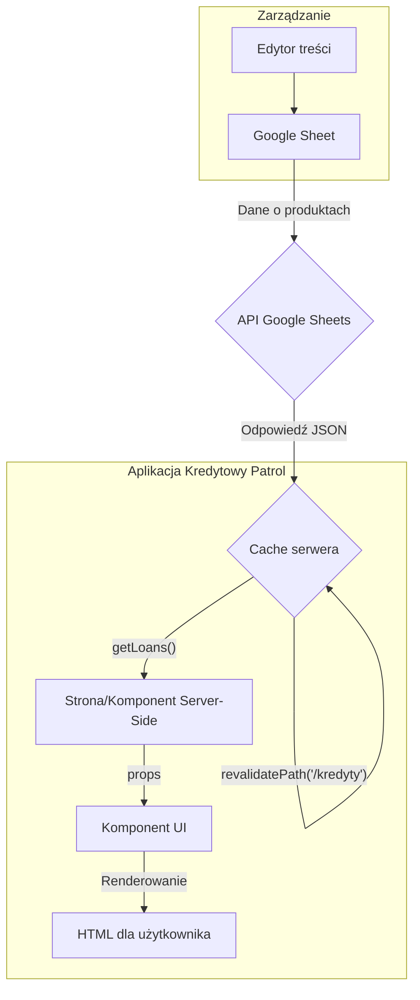

# Przepływ Danych

Ten dokument wyjaśnia, w jaki sposób dane są pobierane, przetwarzane i wyświetlane w aplikacji Kredytowy Patrol. Głównym źródłem danych jest Google Sheets.

## 1. Źródło Danych: Google Sheets

Zamiast tradycyjnej bazy danych, aplikacja wykorzystuje Arkusze Google jako CMS (Content Management System). To rozwiązanie pozwala na łatwe i szybkie zarządzanie ofertami kredytów i lokat bez potrzeby interwencji programistycznej.

- **Arkusze:** Oddzielne arkusze są używane do przechowywania różnych typów danych (np. "Kredyty gotówkowe", "Lokaty").
- **Struktura:** Każdy wiersz w arkuszu odpowiada jednemu produktowi, a kolumny reprezentują jego atrybuty (np. nazwa banku, oprocentowanie, RRSO, okres).

## 2. Pobieranie Danych: Moduł `google-sheets.ts`

Logika odpowiedzialna za komunikację z API Google Sheets znajduje się w pliku `src/lib/google-sheets.ts`.

### Proces Pobierania

1.  **Uwierzytelnienie:** Aplikacja używa klucza API do uwierzytelnienia się w usłudze Google Cloud. Dane uwierzytelniające są przechowywane jako zmienne środowiskowe (`GOOGLE_SHEETS_API_KEY`, `GOOGLE_SHEETS_PRIVATE_KEY`, `GOOGLE_SHEETS_CLIENT_EMAIL`).
2.  **Zapytanie do API:** Funkcje w `google-sheets.ts` (np. `getLoans`, `getDeposits`) wysyłają zapytania do API Google Sheets, określając ID arkusza oraz zakres komórek do pobrania.
3.  **Cache'owanie na Serwerze:** Next.js automatycznie cache'uje wyniki zapytań API po stronie serwera. Aby zapewnić aktualność danych, wdrożono mechanizm rewalidacji on-demand:
    - Endpoint `api/revalidate` jest wywoływany (np. przez webhook z zewnętrznego systemu lub ręcznie), aby unieważnić cache dla określonych ścieżek (`revalidatePath`).
    - Dzięki temu dane na stronie mogą być odświeżane bez konieczności ponownego budowania całej aplikacji.

## 3. Przetwarzanie i Wyświetlanie

1.  **Pobranie Danych w Komponentach Server-Side:** Strony i komponenty serwerowe (renderowane po stronie serwera) w `src/app` wywołują funkcje z `google-sheets.ts`, aby pobrać potrzebne dane. Dzieje się to w trakcie renderowania strony na serwerze.
    ```typescript
    // Przykład w src/app/kredyty/page.tsx
    import { getLoans } from '@/lib/google-sheets';

    export default async function KredytyPage() {
      const loans = await getLoans('Gotówkowe'); 
      // ... reszta komponentu
    }
    ```
2.  **Transformacja Danych:** Pobrane surowe dane (tablica tablic) są transformowane do bardziej ustrukturyzowanej formy (np. tablica obiektów) z odpowiednimi typami, zdefiniowanymi w `src/types/index.ts`.
3.  **Przekazanie do Komponentów:** Przetworzone dane są przekazywane jako `props` do komponentów UI (np. `Ranking`, `LoanCard`), które są odpowiedzialne za ich wyświetlenie.

## Schemat Przepływu Danych

