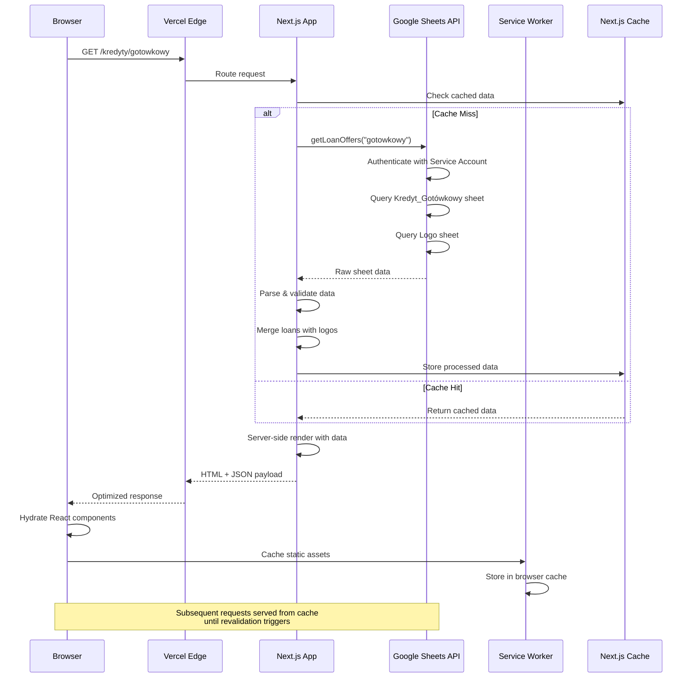
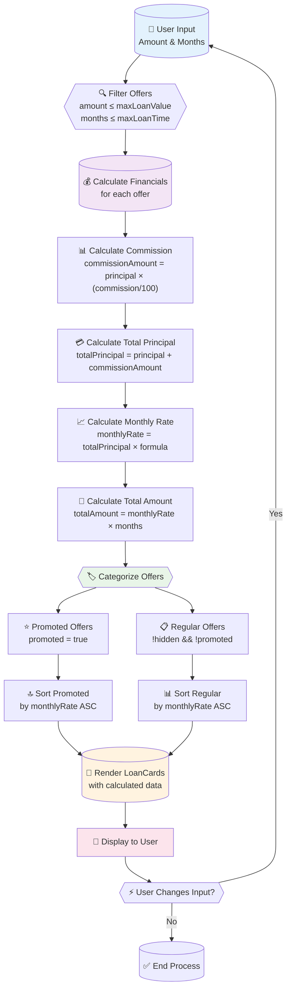
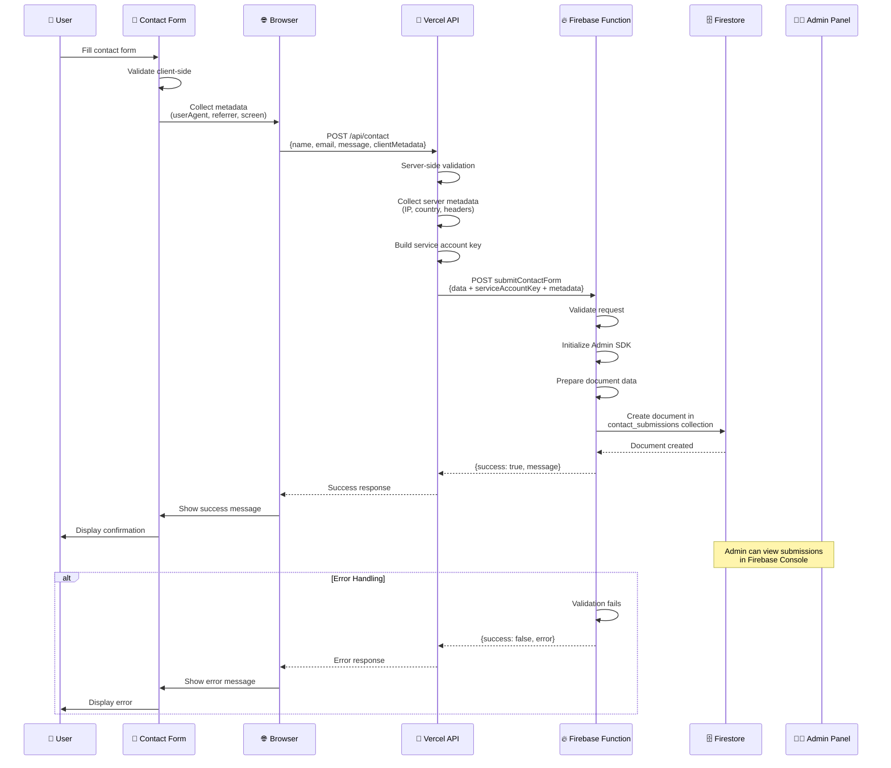
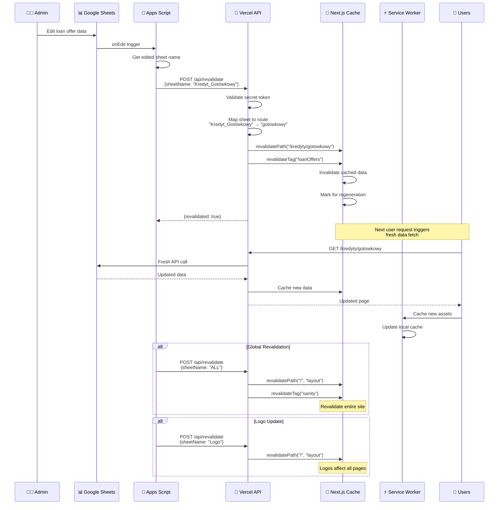

# 🔄 Diagramy UML - Mechanizmy Kredytowy Patrol

## 📋 Spis Treści
1. [Diagram Sekwencji - Pobieranie Danych Finansowych](#diagram-sekwencji---pobieranie-danych-finansowych)
2. [Diagram Aktywności - Proces Obliczania Ofert](#diagram-aktywności---proces-obliczania-ofert)
3. [Diagram Sekwencji - Wysyłanie Formularza Kontaktowego](#diagram-sekwencji---wysyłanie-formularza-kontaktowego)
4. [Diagram Stanu - Zarządzanie Zgodami GDPR](#diagram-stanu---zarządzanie-zgodami-gdpr)
5. [Diagram Sekwencji - System Cache i Rewalidacji](#diagram-sekwencji---system-cache-i-rewalidacji)
6. [Diagram Komponentów - Architektura Analityki](#diagram-komponentów---architektura-analityki)

---

## 1. Diagram Sekwencji - Pobieranie Danych Finansowych

Ten diagram pokazuje jak aplikacja pobiera i przetwarza dane o produktach finansowych z Google Sheets.



---

## 2. Diagram Aktywności - Proces Obliczania Ofert

Pokazuje jak komponenty React obliczają i sortują oferty finansowe na podstawie parametrów użytkownika.



---

## 3. Diagram Sekwencji - Wysyłanie Formularza Kontaktowego

Przedstawia pełny przepływ danych od wypełnienia formularza do zapisu w Firebase Firestore.



---

## 4. Diagram Stanu - Zarządzanie Zgodami GDPR

Pokazuje stany i przejścia w systemie zarządzania zgodami użytkownika zgodnie z GDPR.

```mermaid
stateDiagram-v2
    [*] --> Initial: Page Load
    
    Initial --> CheckingStorage: Check localStorage
    
    CheckingStorage --> NoConsent: No saved consent
    CheckingStorage --> ValidatingConsent: Found saved consent
    
    ValidatingConsent --> ValidConsent: Valid & not expired
    ValidatingConsent --> ExpiredConsent: Expired or invalid version
    
    NoConsent --> ShowingBanner: Display cookie banner
    ExpiredConsent --> ShowingBanner: Clear old consent
    
    ShowingBanner --> AcceptAll: User clicks "Accept All"
    ShowingBanner --> RejectAll: User clicks "Reject All"
    ShowingBanner --> CustomizeConsent: User clicks "Customize"
    
    CustomizeConsent --> PartialConsent: User selects preferences
    
    AcceptAll --> ConsentGranted: All services enabled
    RejectAll --> ConsentMinimal: Only necessary cookies
    PartialConsent --> ConsentPartial: Selected services enabled
    ValidConsent --> ConsentRestored: Restore previous settings
    
    ConsentGranted --> InitializeAnalytics: Enable GA4, GTM, Clarity, Facebook
    ConsentMinimal --> InitializeMinimal: Enable only Cloudflare
    ConsentPartial --> InitializeSelective: Enable based on consent
    ConsentRestored --> InitializeSelective: Restore analytics state
    
    InitializeAnalytics --> Active: System fully operational
    InitializeMinimal --> Active: Basic functionality only
    InitializeSelective --> Active: Partial functionality
    
    Active --> ShowingBanner: User opens preferences
    Active --> ConsentUpdated: Settings changed
    ConsentUpdated --> UpdateAnalytics: Apply new consent
    UpdateAnalytics --> Active: Updated state
    
    state ConsentGranted {
        necessary: true
        analytics: true
        marketing: true
        preferences: true
    }
    
    state ConsentMinimal {
        necessary: true
        analytics: false
        marketing: false
        preferences: false
    }
    
    state ConsentPartial {
        necessary: true
        analytics: ?
        marketing: ?
        preferences: ?
    }
```

---

## 5. Diagram Sekwencji - System Cache i Rewalidacji

Ilustruje jak działa system cache'owania i automatycznej rewalidacji przy zmianach danych.



---

## 6. Diagram Komponentów - Architektura Analityki

Pokazuje architekturę systemu analityki z wieloma platformami i zarządzaniem zgodami.

```mermaid
graph TB
    subgraph "🎭 Consent Management Layer"
        ConsentContext["🍪 ConsentContext<br/><small>Zarządzanie zgodami GDPR</small>"]
        ConsentBanner["🔔 CookieBanner<br/><small>UI zgód użytkownika</small>"]
        ConsentStorage["💾 LocalStorage<br/><small>Przechowywanie preferencji</small>"]
    end
    
    subgraph "🪝 React Hooks Layer"
        useAnalytics["📊 useAnalytics Hook<br/><small>Consent-aware tracking</small>"]
        useConsent["🎯 useConsent Hook<br/><small>Dostęp do stanu zgód</small>"]
    end
    
    subgraph "🔧 Analytics Core Library"
        AnalyticsManager["⚙️ analytics.ts<br/><small>Multi-platform manager</small>"]
        ConsentMapper["🗺️ Consent Mapper<br/><small>GDPR → Platform mapping</small>"]
        EventValidator["✅ Event Validator<br/><small>Data validation & sanitization</small>"]
    end
    
    subgraph "📈 Analytics Platforms"
        GTM["🏷️ Google Tag Manager<br/><small>Central tag management</small>"]
        GA4["📊 Google Analytics 4<br/><small>Behavioral analytics</small>"]
        Clarity["🔍 Microsoft Clarity<br/><small>Session recording & heatmaps</small>"]
        FacebookPixel["📘 Facebook Pixel<br/><small>Conversion tracking</small>"]
        CloudflareAnalytics["☁️ Cloudflare Analytics<br/><small>Privacy-first metrics</small>"]
        VercelAnalytics["🚀 Vercel Analytics<br/><small>Performance monitoring</small>"]
    end
    
    subgraph "🎨 UI Components"
        LoanCard["💳 LoanCard<br/><small>Bank link tracking</small>"]
        Ranking["🏆 Ranking<br/><small>Filter usage tracking</small>"]
        Calculator["🧮 Calculator<br/><small>Usage analytics</small>"]
        ContactForm["📝 ContactForm<br/><small>Form events</small>"]
    end
    
    subgraph "📊 Event Types"
        PageViews["👁️ Page Views<br/><small>Navigation tracking</small>"]
        LoanEvents["💰 Loan Events<br/><small>Interest, comparison, clicks</small>"]
        UserActions["🖱️ User Actions<br/><small>Filters, calculations, forms</small>"]
        ConversionEvents["🎯 Conversions<br/><small>Newsletter, contact, bank CTAs</small>"]
    end
    
    %% Consent Flow
    ConsentBanner --> ConsentContext
    ConsentContext --> ConsentStorage
    ConsentContext --> useConsent
    
    %% Analytics Hook Flow
    useConsent --> useAnalytics
    useAnalytics --> AnalyticsManager
    
    %% Core Analytics Flow
    AnalyticsManager --> ConsentMapper
    AnalyticsManager --> EventValidator
    ConsentMapper --> GTM
    ConsentMapper --> GA4
    ConsentMapper --> Clarity
    ConsentMapper --> FacebookPixel
    
    %% Always-on Analytics (no consent required)
    AnalyticsManager --> CloudflareAnalytics
    AnalyticsManager --> VercelAnalytics
    
    %% Component Events
    LoanCard --> useAnalytics
    Ranking --> useAnalytics
    Calculator --> useAnalytics
    ContactForm --> useAnalytics
    
    %% Event Classification
    useAnalytics --> PageViews
    useAnalytics --> LoanEvents
    useAnalytics --> UserActions
    useAnalytics --> ConversionEvents
    
    %% Platform-specific Events
    GTM --> GA4
    GTM --> FacebookPixel
    PageViews --> GA4
    LoanEvents --> GA4
    UserActions --> Clarity
    ConversionEvents --> FacebookPixel
    
    %% Styling
    classDef consent fill:#e1f5fe,stroke:#01579b,stroke-width:2px
    classDef hooks fill:#f3e5f5,stroke:#4a148c,stroke-width:2px  
    classDef core fill:#e8f5e8,stroke:#1b5e20,stroke-width:2px
    classDef platforms fill:#fff3e0,stroke:#e65100,stroke-width:2px
    classDef components fill:#fce4ec,stroke:#880e4f,stroke-width:2px
    classDef events fill:#f1f8e9,stroke:#33691e,stroke-width:2px
    
    class ConsentContext,ConsentBanner,ConsentStorage consent
    class useAnalytics,useConsent hooks
    class AnalyticsManager,ConsentMapper,EventValidator core
    class GTM,GA4,Clarity,FacebookPixel,CloudflareAnalytics,VercelAnalytics platforms
    class LoanCard,Ranking,Calculator,ContactForm components
    class PageViews,LoanEvents,UserActions,ConversionEvents events
```



---

## 🔍 Szczegóły Implementacyjne

### Kluczowe Mechanizmy:

1. **Pobieranie Danych**: Server-side rendering z cache'owaniem na wielu poziomach
2. **Obliczenia Finansowe**: Real-time calculations w React z useMemo optimization
3. **Formularze**: Proxy przez Vercel API → Firebase Functions → Firestore
4. **GDPR**: Zaawansowany system zgód z mapowaniem na platformy analityczne
5. **Cache**: Multi-layer strategy z automatyczną rewalidacją
6. **Analityka**: Consent-aware tracking z obsługą 6+ platform

### Performance Optimizations:

- **Server Components**: Dane pobierane na serwerze, bez wpływu na bundle size
- **Service Worker**: Intelligent caching strategy dla różnych typów zasobów
- **React Optimizations**: useMemo, useCallback dla expensive calculations
- **Edge Computing**: Vercel Edge Functions dla globalnej dystrybucji

### Security Features:

- **Service Account Authentication**: Bezpieczny dostęp do Google Sheets API
- **Environment Variables**: Sensitive data oddzielone od kodu
- **CORS Protection**: Ograniczenie dostępu do API endpoints
- **Input Validation**: Walidacja na wszystkich poziomach (client/server/Firebase)

---

*Diagramy UML wygenerowane dla projektu Kredytowy Patrol*  
*Ostatnia aktualizacja: Styczeń 2025*
